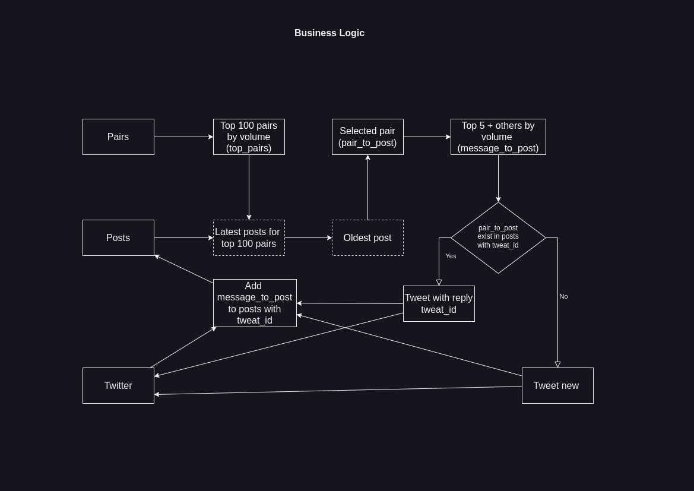

# MarkedCupBoat

It is an attempt to solve the problem: 
MarketCapBot - Automate posting on Twitter

# Task

https://github.com/1712n/challenge/issues/86

# Project structure

```
Project
|-- core/
|   |-- config.py         - Global Settings for project
|   |-- log.py            - Logging
|-- db/                   
|   |-- pairs.py          - Low level working with pairs
|   |-- posts.py          - Low level working with posts
|   |-- session.py        - mongodb connection session
|-- doc/                  - Docs will be
|-- models/               - Models
|   |-- message.py        - model for message_to_post
|   |-- post.py           - model for post
|-- tests/                - pytest
|   |-- conftest.py       
|   |-- test_message.py   - test for message
|-- twitter/              
|   |-- session.py        - Twitter connection
|   |-- tweets.py         - Low level working with tweets
|-- util/
|   |-- messages.py       - Working with messages
|   |-- pairs.py          - Working with pairs
|   |-- posts.py          - Working with posts
|
|.env                     - This file used, if no env vars provided.
|config.yaml              - Global configuration file. Used in core.config
|loggin_config.yaml       - Configuration file for logging. Used in core.log
|
|main.py                  - High level application logic is here.
|README.md
|requirements.txt 
```

# Algorithm

## main.py

Algorithm was divided on two general parts:

- Get data: `get_data()`
  - Get top pairs: 
  - Select pair_to_post: `select_pair_to_post()`
  - Compose message_to_post: `compose_message_to_post()`
- Publish data: `publish_data()`
  - Send message to Twitter: `send_message()`
  - Add message_to_post to posts: `add_message_to_posts()`

# Configuration

Project configuration stored in config.yaml
Logging configuration stored in logging_config.yaml.
If no environmental variables provided, then db.core.Settings will try to read .env file.

# Scheme


